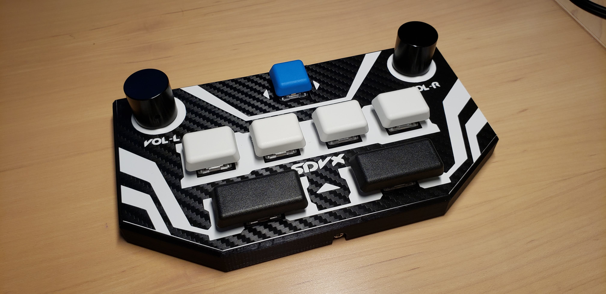
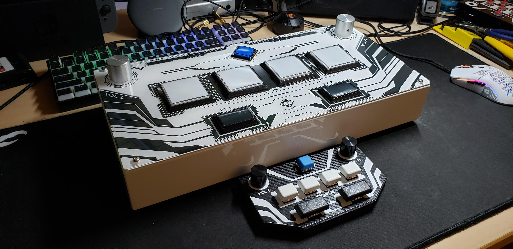
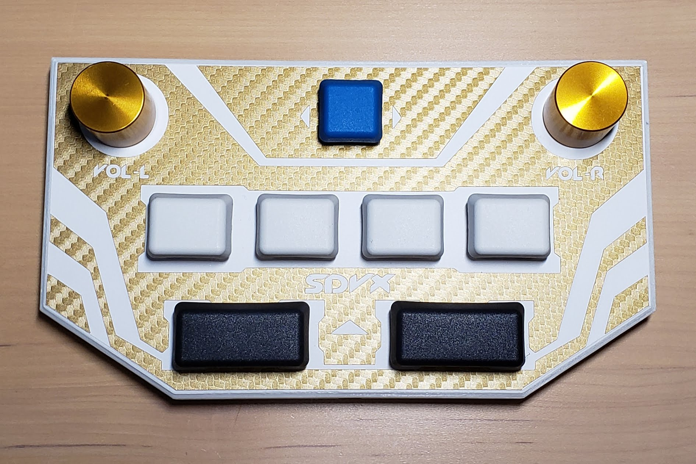
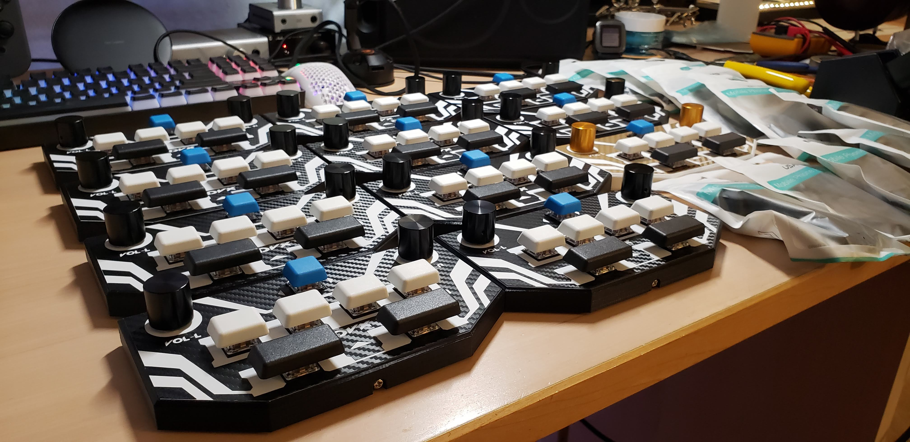
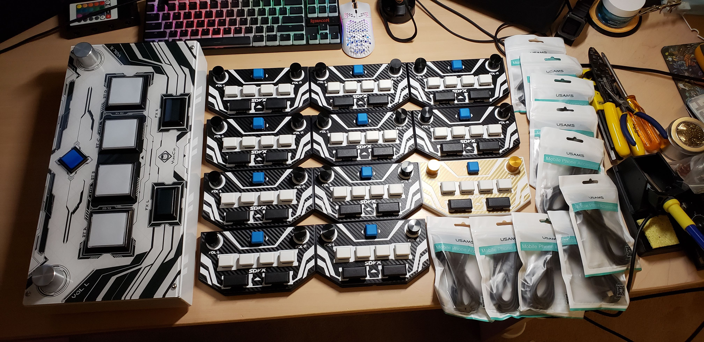

# Pocket-SDVX
A mini controller for games such as Sound Voltex, USC, KShoot, osu 4k, etc.  Based off of mon's Pocket Voltex and Cammy's pocketvtx!

## Features
- Super small - About 7" x 4" and a little over 1/2" high (About 1-1/2" including knobs)
- 7 Gateron Red Keyswitches (Start, BT-A, BT-B, BT-C, BT-D, FX-L, FX-R)
- PBT G20 Keycaps
- Quality Bourns Encoders (VOL-L, VOL-R)
- Solid Aluminum Black 20mm Knobs
- Vinyl Skinned Top & Bottom
- 6 Rubber Feet
- Single Screw Back Panel
- Arduino Pro Micro based
- Acts as a gamepad or keyboard/mouse.  While plugging in, hold BTN-A for 3-4s for gamepad mode.  Hold BTN-B instead for keyboard/mouse mode.
- USB-C Input

## Video Guide
- A really low-quality video guide series I made at 4:00am: https://www.youtube.com/playlist?list=PLSlCMOwxujV7-DYrM4eC2Sb4_rMR5udEE .
  - Perhaps it will be useful to some of you.

## General Assembly Instructions
- 3D print case and cover
- Cut vinyls: layer1, layer2, cover
- Weed vinyls(remove excess).
- Clean face with rubbing/isopropyl alcohol and apply skin using transfer tape.  Apply layer1, then layer2.  Then apply cover.
  - Note: Shine a flashlight on the case's corner to more easily see where to line up the skin.  I make my skins every so slightly smaller than the actual face for more leeway.  The skin's width is ~169mm (scale the skin proportionally).
  - Note 2: I have lazily taken cover and scaled it down.  Thus, the spacing around the edge is probably a bit uneven.  Apply to the best of your ability.  The skin's width is ~165mm (scale the skin proportionally).
- Insert Gateron switches and secure each corner of the switch with hot glue on the inside.  See video Part 1 for details.
- Using a soldering iron, tin all contacts on the Gateron switches.
- Wire up all the common/ground for the switches and the encoders.  See video Part 2 for details.
- Wire up all the switches and encoders with their own individual wire.
- Solder all the wires to the board.  See video Part 3 for details.
  - Arduino Pro Micro Pinout
    - VOL-L A 2
    - VOL-L B 3
    - VOL_R A RX1
    - VOL_R B TX0
    - BT_ST   4
    - BT_A    5
    - BT_B    6
    - BT_C    7
    - BT_D    8
    - FX_L    9
    - FX_R    10
- Plug in your arduino and flash firmware.  See video Part 4 for details.
- BOOT IN KEYBOARD MODE(Hold the second button from the left for 3-4s while plugging it in).  TEST to make sure everything works.  See video Part 5 for details.
- Plug in micro usb to USB-C adapter cable into the arduino.  Slide arduino into its slot and route the USB-C cable.  See video Part 6 for details.
- Push encoders through their holes.  Mount with washer and nut.
- Bend metal encoder mounting tabs 45 degrees outward.  Additionally, bend one of the protrusions slightly inward so it doesn't collide with the micro usb cable.
- Do some cable management.  Carefully flatten the cables.
- Hot glue USB-C port.
- Slide in the cover and secure with M3x5 screw.  PLEASE be careful, as you are threading into plastic and thus the hole is easily strippable.  See video Part 7 for details.
- Wipe circles on the bottom with rubbing/isopropyl alcohol.  Apply adhesive rubber feet.
- Mount keycaps.  See video Part 8 for details.
- Mount knobs.  Use the arduino pin headers as a spacer on each side so the knobs are the same height and don't rub on the encoder nub.
### Done.  Enjoy!!

## Parts Required:
- 1x 3D Printed Case (1.2mm walls, top, bottom layers; 20-25% infill minimum)
- 1x 3D Printed Cover
- 1x layer1 Vinyl Skin [width is ~169mm (scale the skin proportionally)]
- 1x layer2 Vinyl Skin [width is ~169mm (scale the skin proportionally)]
- 1x cover Vinyl Skin [width is ~165mm (scale the skin proportionally)]
- 7x Gateron Red Keyswitches
- 2x Bourns PEC16-2015F-N0024 Encoders
- 1x 1x1 G20 Keycap
- 4x 1x1.25 G20 Keycap
- 2x 1x2 G20 Keycap
- 2x 20mm Diameter Solid Aluminum Knobs (20mm high used, 22mm height should work as well)
- 1x Arduino Pro Micro
- 6x Rubber Feet (0.8-1mm in diameter)
- 1x Micro USB Male to USB C Female (27cm length)
- 1x M3x5 Screw
- Cat5e Cable (~2 feet, strip it open and take a twist of wire)
- Hot Glue
- Solder
- USB C cable (preferably one with deep insertion)

## Recommended Tools/Etc.
- Temperature Controlled Soldering Iron
- Hot Glue Gun
- Needle Nose Pliers
- Phillips Screwdriver (if you use a phillips head M3 screw)
- Allen Key (for knobs' grubscrew, M3 screw if you have a hex head)
- Rubbing/Isopropyl Alcohol
- Microfiber Cloth (for cleaning w/ alcohol)
- Eye Protection + Safety Mask

## Links I used to make the first batch of 10
- Gateron Red Keyswitches: https://kbdfans.com/collections/gateron-swithes/products/gateron-swtich-3pin-or-5pin?variant=35765199373
- Bourns PEC16-2015F-N0024 Encoders: https://www.mouser.com/ProductDetail/Bourns/PEC16-2015F-N0024?qs=sGAEpiMZZMsWp46O%252Bq11WTXwm4kPVvHwmPh3cKfowck%3D
- 1x1 G20 Keycap (BCT): https://pimpmykeyboard.com/g20-1-space-pack-of-10/
- 1x1.25 G20 Keycap (WAN): https://pimpmykeyboard.com/g20-1-25-space-pack-of-4/
- 1x2 G20 Keycap (NEM): https://pimpmykeyboard.com/g20-2-space-pack-of-4/
- 20mm Diameter Solid Aluminum Knobs: https://www.aliexpress.com/item/32912465745.html?spm=a2g0o.cart.0.0.43bd3c00dwdyAf&mp=1
- Arduino Pro Micro (WARNING: CONTAINS 10): https://www.aliexpress.com/item/4000045084392.html
- Rubber Feet: https://www.ebay.com/itm/50PCS-Rubber-Feet-Clear-Semicircle-Bumpers-Door-Silicone-Buffer-Pad-Furniture/152925672374
- Micro USB Male to USB C Female: https://www.aliexpress.com/item/32983342667.html
- M3x5 Screw: https://www.ebay.com/itm/20X-M3-3-80mm-Round-Pan-Head-Phillips-Screws-304-Stainless-Steel-Machine-Screws/302237442873?
- USB C cable (WARNING: CONTAINS 10): https://www.aliexpress.com/item/33032210292.html

## Miscellaneous Info
- If the rubber feet aren't doing their job, they're probably dusty.  Wipe them down with a little bit of rubbing alcohol.
- Encoders have an initial break-in period.  If they are stiff, rotate them for a few minutes to break them in.
- This work is licensed under a Creative Commons Attribution-NonCommercial-ShareAlike 4.0 International License.

## Thanks To
- Cammy for helping me build my first minicon.  The Pocket SDVX uses a slightly modified version of his firmware.
- Everyone in the Cons & Stuff Discord channel.
- mon for his initial development of the Pocket Voltex.
- The 10 people who purchased my first exclusive batch of Pocket SDVXs!  Thanks to you guys, I can get a full-size controller as well!

## Links to other GitHubs
- https://github.com/camprevail/pocketvtx
- https://github.com/mon/PocketVoltex

## Possible To-Do List
- LED lights
- Increase spacing between BTN and FX
- Actually make a cover vinyl that fits right
- M3 Nut hole on cover
- Tweak vinyl skin aesthetic button size cutouts
